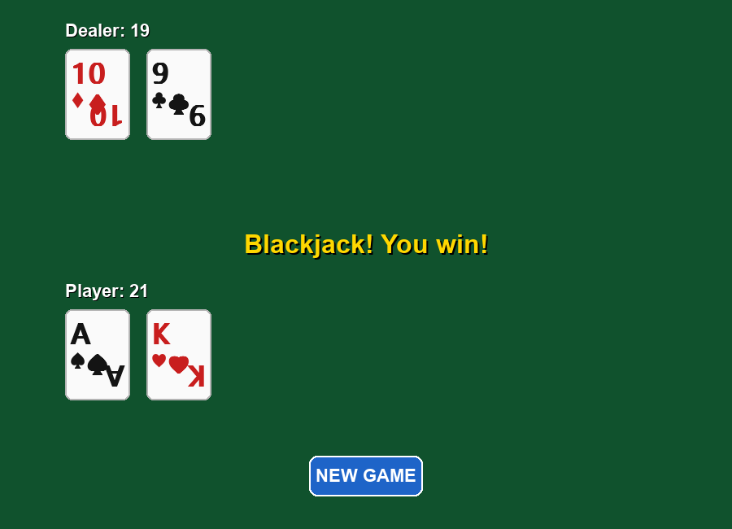

# Blackjack

A complete, playable Blackjack game built with Python and Pygame. Single
deck, standard casino rules, clean table layout.


*A round in progress — the dealer's hole card is face down, and only the
up card counts toward the displayed dealer total.*



*A finished round. The hole card is revealed and the outcome is shown at
the centre of the table.*

---

## Features

- **Full 52-card deck** — all 13 ranks across 4 suits, reshuffled every round
- **Correct soft-ace scoring** — an Ace counts as 11 or 1, automatically
  corrected to the best value that does not bust the hand
- **Instant blackjack detection** — a natural 21 on the deal ends the round
  immediately, for either side
- **Standard dealer AI** — the dealer hits until 17 or higher and stands on
  soft 17, matching casino rules
- **Complete outcome handling** — win, lose, push and blackjack, each with
  its own message and colour
- **Clean table layout** — dark green felt, cards drawn as rounded rectangles
  with the rank and suit in the corners and a large suit pip in the centre
- **Hover feedback** on every button

Deliberately out of scope: no betting or chip tracking, no sound, no card
animations, no statistics. Just the game.

## Requirements

- Python 3.10 or newer
- [Pygame](https://www.pygame.org/) 2.5+

## Installation

```bash
pip install -r requirements.txt
```

## Running

```bash
python ui.py
```

A round is dealt automatically on launch.

## How to Play

| Action | What it does |
|--------|--------------|
| **HIT** | Draw another card. Going over 21 busts you and ends the round. |
| **STAND** | End your turn. The dealer reveals the hole card and plays out. |
| **NEW GAME** | Appears once the round is over. Deals a fresh hand. |

Get as close to 21 as you can without going over, and beat the dealer's total.

## Rules

- Number cards are worth their face value
- Face cards (J, Q, K) are worth 10
- Aces are worth 11, or 1 if 11 would bust the hand
- The dealer hits until their hand is 17 or higher
- **Blackjack** — 21 on your first two cards — beats an ordinary 21 made with
  three or more cards
- Going over 21 (**bust**) loses immediately
- Equal totals are a **push** (a tie)

## Architecture

The project is split so that the rules and the rendering never mix:

```
blackjack_game/
├── game.py           # Game engine — deck, hands, scoring, dealer AI
├── ui.py             # Pygame rendering and input handling
├── config.py         # Constants — colours, card sizes, layout, fonts
├── docs/             # Screenshots
├── requirements.txt
└── README.md
```

`game.py` contains no rendering code and never imports Pygame. `ui.py`
contains no rules — it reads the engine's public properties each frame and
draws them, holding no state of its own. That separation means the game
logic can be exercised without opening a window, and the screen can never
disagree with the engine about the score.

**Key types**

- `Card` — a frozen dataclass holding a rank and suit, with a computed value
- `Hand` — a list of cards, with `value`, `is_bust`, `is_blackjack` and
  `is_soft` derived from it
- `Deck` — a shuffled 52-card deck that deals from the top
- `BlackjackGame` — the round engine: deals, applies player actions, runs the
  dealer, and resolves the outcome
- `GameState` — the round lifecycle: `DEALING → PLAYER → DEALER → OVER`

## Notes on this version

This is the initial implementation. It has no automated test suite yet — a
later revision extracts the ace-scoring arithmetic into a single shared
function, replaces the string results with an enum, and adds engine and
headless UI tests.

## License

MIT — see [LICENSE](LICENSE).
