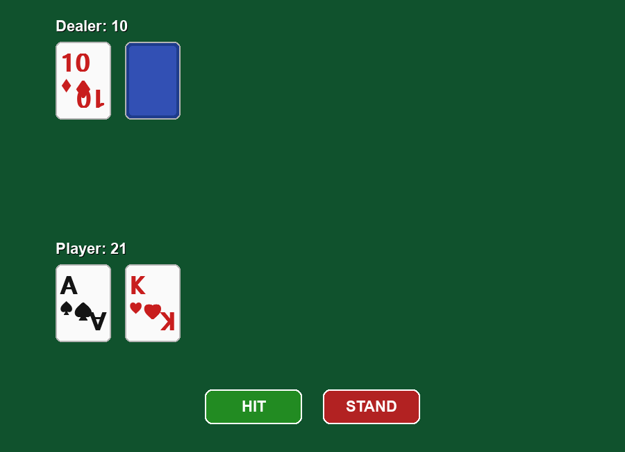

# Blackjack

A playable Blackjack game in Python and Pygame. Single deck, standard casino
rules, three files.



## What it does

Full 52-card deck, reshuffled every round. Aces count as 11 or 1 and correct
themselves to whatever doesn't bust the hand. The dealer hits to 17 and stands
on soft 17. A blackjack on the deal ends the round immediately, for either
side, and win, lose, push and blackjack each get their own message.

No betting, no chips, no sound, no animations. Those were left out on purpose.

## Running it

```bash
pip install -r requirements.txt
python ui.py
```

Python 3.10+ and Pygame 2.5+.

## Tests

```bash
python test_game.py    # 65 checks: scoring, dealer AI, win/lose/push
python test_ui.py      # 22 checks: buttons, rendering, a full round
```

Plain Python, no pytest. `test_ui.py` uses SDL's dummy video driver, so it
runs over SSH or in CI.

## How it's put together

```
game.py      the rules: deck, hands, scoring, dealer, outcome
ui.py        drawing and input
config.py    colours, sizes, positions, fonts
```

`game.py` never imports Pygame. `ui.py` never decides anything about the game.
It reads the engine's properties each frame and paints them, and it keeps no
score of its own, so the window can't disagree with the engine about what's
happening. That's also why the rules are testable from a terminal without
opening a window.

## AI assistance

I built this with an AI coding assistant, and I'd rather say so up front than
have it come up later.

The split: I set the scope, the three-file structure, and what to leave out,
and I reviewed and ran everything before it went in. The assistant wrote the
implementation and the tests. It also caught things I'd missed, including a
scoring loop duplicated across two methods, a redundant event handler, and a
wrong assumption in my own tests about how often a deal is an instant
blackjack. The commit history is the real record of what changed and why.

## License

MIT. See [LICENSE](LICENSE).
